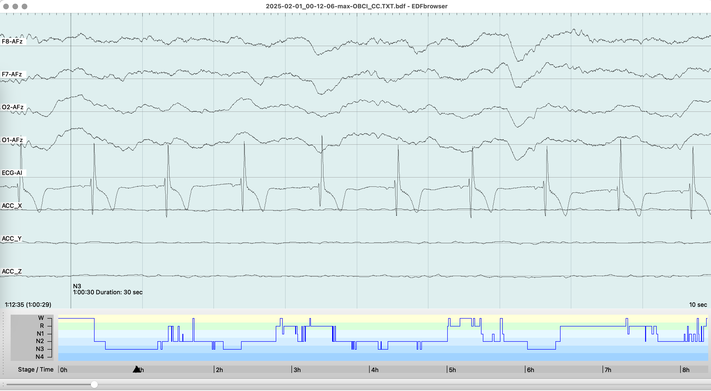

I run these scripts at my **macbook m3** as part of my home personal sleep research to start session and collect data from OpenBCI. 
OpenBCI allows for gold-standard PSG (EEG, ECG etc) data collection. 
Device is good enough for daily use, setting up montage (DIY headband) and start a session usually takes 4-5 minutes. Read more [here](https://blog.kto.to/hypnodyne-zmax-vs-openbci-eeg-psg)

# sleep_analysis.py plots examples
Revealing the beauty of sleep :) 
Here are example plots for F7,F8,O1,O2 EEG channels referenced to AFz with ground at Fp2, ECG channel lead A-I.

Hypnogram: final consensus


Hypnogram: by channel

Top one is Max probs - select most often stage across all channels

Second one is Adj probs - for each stage sum probabilites by each channel and select stage with biggest probability sum. Only slightly differs from Max probs because takes into account predicted probabilities

Bottom 4 hypnos - prediction for each channel (channel name in header text)


Topomap, re-referenced to Average, so we can include AFz to look for most dense SWS point where N3 deep sleep slow waves originate.

Y - sleep stages, X - different power bands.


Merged Spectrum (max across all channels)


Spectrum: for each channel


Slow Waves Amplitude and count (by channel, by stage), Spindles (by channel), PSD (by channel)


HR & HRV (ECG) by sleep stages, major movements, arrythmia/artifacts detection (all abbreviations explained below)
* Red line - HR
* Green line & dots - HRV
* Blue bars (at the bottom) - accelerometer, Blue squares (at the top) - major movements
* Violet dots - HRV points inside major N3 segments during first two sleep cycles (first 180 minutes after SOL) which used for N3 RMSSD calculation
* Red dots - HRV points during REM, do not confuse them with HR
* Standard hypnogram stages colored (N3 violet, N2 blue, REM red, Awake yellow)
  


Radar plot with percentage deviations from goals, green circe is a perfect fit for goals set. 
Goals can be changed manually in script.
Positive values meaning desired direction (less movements results in increased percentage, more N3 also leads to increase), so just aiming all metrics to reach green circle


After script is run you can import hypnogram located in cache_dir, named like datetime user probs_adj_consensus.csv file into [EDFBrowser](https://www.teuniz.net/edfbrowser/).




# script configs
Each script comes with config file which is name as script but with yml extension. 
* Simply rename session_start.yml.sample to session_start.yml, configure directroies
* Repeat for each script, but careful - session_dir and name should be same for sd_convert and session_start

# session_start.py
Script to start OpenBCI session in a single click, usually for sleep EEG acquisiton purposes. 
* Used to start session with data saved on sd with desired sampling frequency (for greater than 250Hz modded [firmware](https://github.com/roflecopter/OpenBCI_Cyton_Library_SD) need to be flashed, otherwise it will always write with default 250Hz).
* Saves session start timestamp and settings into sqlite file (session_dir/sessions.db). Session info will be used in sd_convert.py script
* Config: setup port and session_dir

# sd_convert.py
Script to convert OpenBCI SD card .TXT files to 
* 24-bit BDF with calibrated values. Accelerometer data is upsampled to match ADS sampling rate.
* Recording timestamp and settings taken from sqlite db which automatically created and updated by session_start.py script
* Config: setup sd_dir (openbci sd card mountpoint, e.g. /Volumes/OBCI for mac), data_dir (for output files) and session_dir (must be equal to session_start.yml)

# session_analyse.py
Script to analyses recorded sessions. Suited for short sessions (like meditations etc).
Periods (and other settings) are defined for each session in sessions variable inside script.
* Reads raw BDF file from sd_convert and filter it, split into epochs and rejects bad ones (autoreject)
* Plot Multitaper Spectrogram for each channel, highlights bad epochs (autoreject) and periods
* Plot Amplitude topomaps based on good epochs passed into yasa.bandpower for each period defined in sessions
* Plot PSD / Frequency plot for each channel and period computed with mne.compute_psd(method='welch')
* Plot Band Power (delta, theta, alpha, beta, gamma) vs time and highlings band epochs (autoreject) and periods
* Config: setup multitaper_dir (multitaper toolbox repo) and data_dir (where bdf files for analysis are located)

# sleep_analyse.py
Script to analyse recored sleep session. 
Make sure to copy and rename sleep_analysis.yml.sample to sleep_analysis.yml and set 3 directories - bdf file directory location, cache dir location (csv will be stored here) and image dir location (plot pngs will be stored here)
* You have to pass your BDF file created by sd_convert.py into sleeps array inside script (edit script to put filename manually)
* Script then reads raw BDF file and filter it
* Builds hypnograms with YASA and make plots (for each channel, max probablity and adjusted consensus)
* Plot Multitaper Spectrogram
* Plot Amplitude topomaps grouped by sleep stage
* Plot PSD / Frequency plot (easy to see bad channels)
* Plot HR, HRV for whole sleep period and for N3 / REM. HRV Plot includes major accelerometer movements.
* Save hypnograms to csv in cache folder for easy import in EDFBrowser (Sleep Staging > How do I edit the predicted hypnogram in https://raphaelvallat.com/yasa/faq.html#sleep-staging  for more details)
* Cache HRV data into CSV
* Save plots into image folder in PNG format)
* Config: setup multitaper_dir and datadir similarly as for session_analyse.yml and cache_dir (save hrv/hypnogram csv files) and image_dir to have plots save to png.

# sleep_analyse.py ECG Processing
For ECG/HRV processing [qskit](https://github.com/roflecopter/qskit) is required and ECG channel name in BDF must be set in ecg_ch variable. I usually use ECG-AI in session_start.py, set emg_channels = {'ECG-AI':4}. If you want to use another name - thats fine, but add it to sleep_analyse.py ecg_ch list to make sure it will be detected as ECG. Only first ECG channel will be processed (manually cycle hrv_process() if you need multiple)

HRV plot have custom header:
* M38 / MH4.83 means there were 38 major accelerometer movements or 4.83 per hour of sleep (TST).
* (5% / 5%) means ~5% of HR and ~5% HRV epochs (HR and HRV processed separately) contained artifacts (which were discarded or autofixed). There always be artifacts due to movements / arrythmia / other muscle / noise. Less than 10% is good enough, if you have more than 10-15% - check your ECG signal for potential issues.
* HR & RMSSD lines contain Average±STD per whole period, then Average±STD during N3 (during 1st and 2nd sleep cycle), then Average±STD during REM
* L/H = LF / HF
* A113 M0.5 E0.8 Ec70 L42.7 - this is stats from ECG arrythmia analysis by qskit. Its experimental. M is missed beats per hour, E is extra beats per hour, Ec is ectopic beats per hour, L is longshort beats per hour and A (all) is summ of all per hour . M/E/Ec/L is detected by neurokit [signal_fixpeaks](https://neuropsychology.github.io/NeuroKit/functions/signal.html#signal-fixpeaks) method with detection method="Kubios" and is called in qskit [hrv_process.py](https://github.com/roflecopter/qskit/blob/main/qskit/hrv/hrv_process.py) during 1st round of R-peaks correction. I've developed this pipeline for Shimmer ECG and then adapted to OpenBCI ECG signal (Ten20 paste, bipolar gold-cup electrodes, [A-I position](https://blog.kto.to/bl-content/uploads/pages/autosave-ed05f773969d771675dafb13756d9194/leads.png)). Make sure ECG signal R-peaks are at the top in EDFBrowser, otherwise use ecg_invert=True in sleeps variable to flip ECG signal

# Quickstart
* install / setup Python 3.11 environment or use global
* pull repo and cd into it
* run pip3 install -r requirements.txt
* optional: flash modded [firmware](https://github.com/roflecopter/OpenBCI_Cyton_Library_SD) if you want 500Hz sampling rate and flashing LED during sd card write session
* put sd card into macbook and set desired name, for example OBCI. For mac full path should be /Volumes/OBCI, copy go sd_convert.yml.sample and rename it to sd_convert.yml, open in notepad and set sd_dir value to '/Volumes/OBCI'
* turn on board and insert Cyton USB dongle with switch at position GPIO6
* run ls /dev and look for something like /dev/cu.usbserial-D200PMQM, exact name is required to start session. Put it into session_start.yml
* turn on board into PC position
* optional: run OpenBCI_GUI for visual inspection of signal / montage and for impendance check. Stop session before running session_start.py
* it is recommended to verify/modify session_start.py and sd_convert default settings, directories set in yml configs, other settings inside script, set them according to montage: duration, channels, gain, sampling rate. The default montage is something like {'F7-T3':0,'F8-T3':1,'O2-T3':2} with sf = 250Hz, gain = 24 and 24H duration. Make sure port, session_dir, session_file setup in session_start.ymld and sd_dir, session_dir, session_file setup in sd_convert.yml, these settings are mandatory. Session_dir, session_file should be same in both files.
* device port from config will be passed to board with: board = pyOpenBCI.OpenBCICyton(port='/dev/cu.usbserial-D200PMQM', daisy=False)
* run python3 session_start.py from terminal
* watch for any error messages to appear. Script will use serial interface to check board mode, will set sf, gain, setup channels and allocate space for recording on sd card, will save allocated file name, re-check sf and start session if everything is fine. Immediately after start it will save recording filename, current time and all settings into sqlite db located in session_dir/session_file. If db isnt exists new will be created.
Here is expected terminal output for python3 session_start.py:
```
cyton: sleep, Gold Cup OpenBCI, Ten20, g24, 500Hz, 12H
{'F8-AFz': 0, 'F7-AFz': 1, 'O2-AFz': 2, 'O1-AFz': 3}, ground: Fp2, emg: {'ECG-AI': 4}
Serial established
mode is default
sampling rate set to 500
x1060110Xx2060110Xx3060110Xx4060110Xx5060000Xx6160000Xx7160000Xx8160000X
channels set: {'F8-AFz': 0, 'F7-AFz': 1, 'O2-AFz': 2, 'O1-AFz': 3, 'ECG-AI': 4}
Wiring and sdcard is correct.
Size 4864000 SD file OBCI_CD.TXcce:T
$$$

SD blocks: 4864000 and max duration: 720 minutes
SD file init success OBCI_CD.TXT
Success: Sample rate is 500Hz$$$
Session started at 2025-02-02 01:35:24.230442
Closing Serial
```
* board with modded [firmware](https://github.com/roflecopter/OpenBCI_Cyton_Library_SD) will start turn on / off LED every 5s to confirm SD recording is started
* to stop session just turn off board, pull out sd card and insert it into macbook
* in macos you can format sd card from terminal
```
# find disk number in dev with 'diskutil list', for example disk4
# fill disk with zeros
sudo diskutil zeroDisk /dev/disk4
# format to FAT32
sudo diskutil eraseDisk FAT32 OBCI MBRFormat /dev/disk4
sudo diskutil mountDisk /dev/disk4
# use 'diskutil list' to confirm disk4 has DOS_FAT_32 type
diskutil list:
    /dev/disk4 (internal, physical):
       #:                       TYPE NAME                    SIZE       IDENTIFIER
       0:     FDisk_partition_scheme                        *31.9 GB    disk4
       1:                 DOS_FAT_32 OBCI                    31.9 GB    disk4s1
# read 100mb of data after 50mb and confirm zeros (press q after command executed)
sudo dd if=/dev/disk4 bs=1m skip=50 count=100 | hexdump -C | less
    100+0 records in
    100+0 records out
    104857600 bytes transferred in 3.251993 secs (32244104 bytes/sec)
    00000000  00 00 00 00 00 00 00 00  00 00 00 00 00 00 00 00  |................|
    *
    06400000
```
* make sure config dirs correct and run python3 sd_convert.py
* script will list sd_dir files, select last one and then tries to find session information for that file from sqlite db. If nothing found default settings will be used.
* as a result .BDF and .CSV with uV for EEG and g for ACCEL values will be created inside data_dir directory (create all dirs in yml configs if they arent exist before starting a session)
* it is recommended to copy .TXT file to backup it somewhere else for possible re-processing in a future.
* i didnt test scripts on windows / linux, but i assume that with no or little modifications they should work.
* if something is not working and you want it to work / or want to add functionality - feel free to send pull request with fix / functionality. You can open issue and ask questions.
* P.S. I'm not a python developer so my code might doesnt look well.
